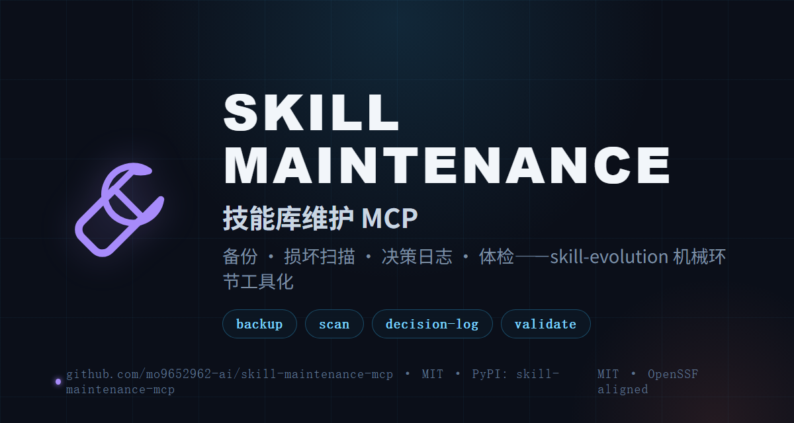

<div align="center">

  

  # SKILL MAINTENANCE MCP

  **Back up before edits · scan after writes · log decisions · health-check regularly**

  **skill-maintenance-mcp turns the mechanical steps of the [skill-evolution] methodology (backup / corruption scan / decision log / health check) into 5 MCP tools. Judgment calls like distillation and pruning stay on the skill side — this repo owns the parts that must never drift or be skipped. Listed on the [MCP Registry](https://registry.modelcontextprotocol.io).**

  <p>
    <a href="README.md">🇨🇳 中文</a>
    ·
    <a href="https://pypi.org/project/skill-maintenance-mcp/">PyPI</a>
    ·
    <a href="CHANGELOG.md">CHANGELOG</a>
    ·
    <a href="LICENSE">MIT</a>
  </p>

  <p>
    <a href="https://github.com/mo9652962-ai/skill-maintenance-mcp/actions/workflows/ci.yml"></a>
    <a href="https://pypi.org/project/skill-maintenance-mcp/"></a>
    
  </p>
</div>

<div align="center">
  
</div>

## The 5 tools

| Tool | Step | What it does |
|:---|:---|:---|
| `skill_backup` | §7 pre-edit backup | Copies skill dirs to `~/.agents/skill-backups/<date>/`; same-day same-name overwrites are rejected |
| `skill_scan_corruption` | §7 corruption scan (iron rule) | Detects formfeed (`\x0c`), real tabs, mid-line CRs — silent damage from JSON-serialized writes; CRLF endings are not false positives |
| `skill_log_decision` | §2 decision history | Appends a 4-field entry (diagnosis/revision/evidence/result) to `references/decision-log.md`; missing fields are rejected |
| `skill_read_decisions` | §2 | Entry title list — read before revising to avoid repeat mistakes |
| `skill_validate` | §3/§4 health check | frontmatter required fields + corruption scan + orphan references + decision-log summary |

Full parameter tables (verified against `src/skill_maintenance_mcp/server.py` signatures) are in the [中文 README](README.md).

## 🚀 Quick start

```bash
uvx skill-maintenance-mcp        # stdio · any MCP client
```

Register (ZCode `~/.zcode/cli/config.json` → `mcp.servers`, or Claude Desktop):

```json
{ "mcp": { "servers": { "skill-maintenance": { "command": "uvx", "args": ["skill-maintenance-mcp"] } } } }
```

## The two iron rules

1. **Back up before every revision** — run `skill_backup` first; the backup dir is snapshot-semantics and rejects same-day overwrites.
2. **Run the corruption scan after every write** — formfeed / real tab / mid-line CR damage from JSON serialization is invisible to the eye; `skill_scan_corruption` must close the loop.

## Workflow

```
skill_backup → edit → skill_scan_corruption → skill_log_decision → skill_validate
```

Read `skill_read_decisions` first to avoid repeating past mistakes.

## Design boundaries

- **No automatic byte-level repair** — fixes are case-by-case (skill-evolution §7); the tool locates line + kind + snippet only.
- **Backups reject same-day overwrites** — move the first snapshot aside manually.
- **No yaml dependency** — frontmatter is parsed as flat `key: value` pairs, covering common skill files.

## License

[MIT](./LICENSE)
